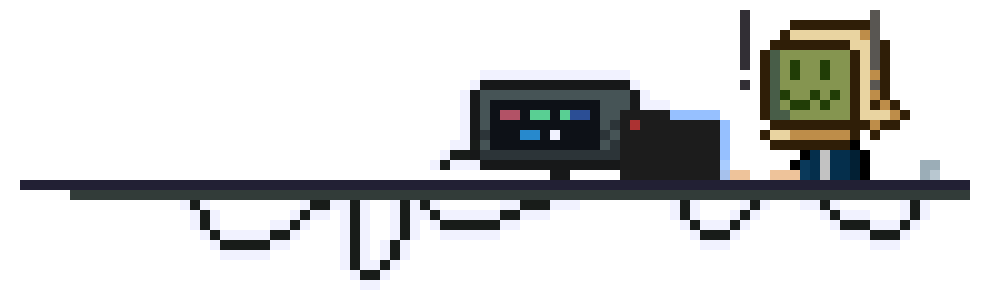

<!-- Banner GIF -->

  

<!-- Typing SVG -->

  

<!-- Introduction -->
### 👋 About Me

I'm Diego Miñano, a passionate Software Engineering student with a love for low poly and pixel art. My interests revolve around the fascinating world of graphics computing, where I blend my skills in software development and game creation.

- 💻 Software Engineering | Game Developer | 3D Artist
- 🎮 Working on exciting game projects
- 🚀 Continuously learning and experimenting with new technologies

<!-- Stats -->
### 📊 GitHub Stats

  

<!-- Contact -->
### 📫 How to Reach Me

- [LinkedIn](https://www.linkedin.com/in/diego-mi%C3%B1ano)
- [Twitter](https://twitter.com/your-twitter-handle)
- [Email](mailto:your-email@example.com)

<!-- Footer -->

  

<!--
**Gatorrante/Gatorrante** is a ✨ _special_ ✨ repository because its `README.md` (this file) appears on your GitHub profile.

Here are some ideas to get you started:

- 🔭 I’m currently working on ...
- 🌱 I’m currently learning ...
- 👯 I’m looking to collaborate on ...
- 🤔 I’m looking for help with ...
- 💬 Ask me about ...
- 📫 How to reach me: ...
- 😄 Pronouns: ...
- ⚡ Fun fact: ...
-->
